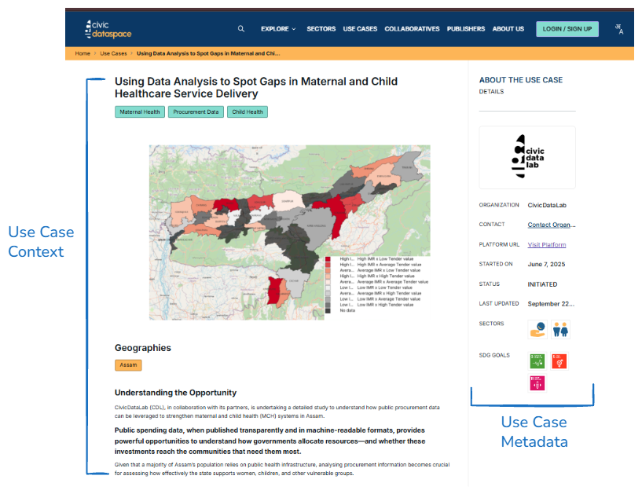
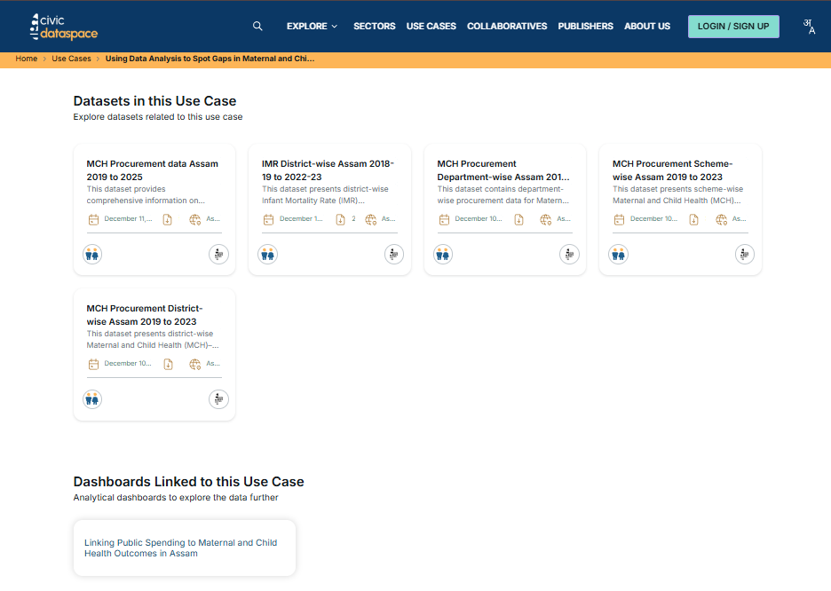

Exploring a Use Case
======================

This section walks through one of the six use cases in the FemHealth Data Collaborative - Using Data Analysis to Spot Gaps in Maternal and Child Healthcare Service Delivery - showing what you can learn from it and how to navigate the dashboard yourself.

*Figure 1.1: Navigating the Use Case Page*

*Figure 1.2: Scroll to explore data and dashboards associated with a use case*

.. toctree::
   :maxdepth: 2

   usage_scenarios_procurement
   usage_scenarios_health_outcomes
   where_to_go_from_here
