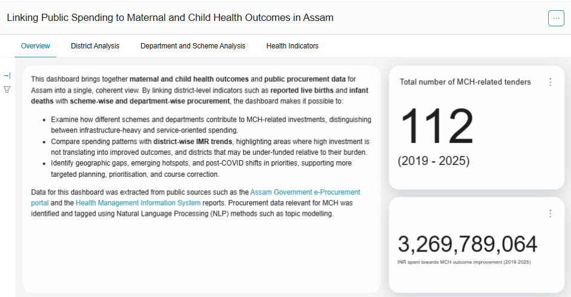
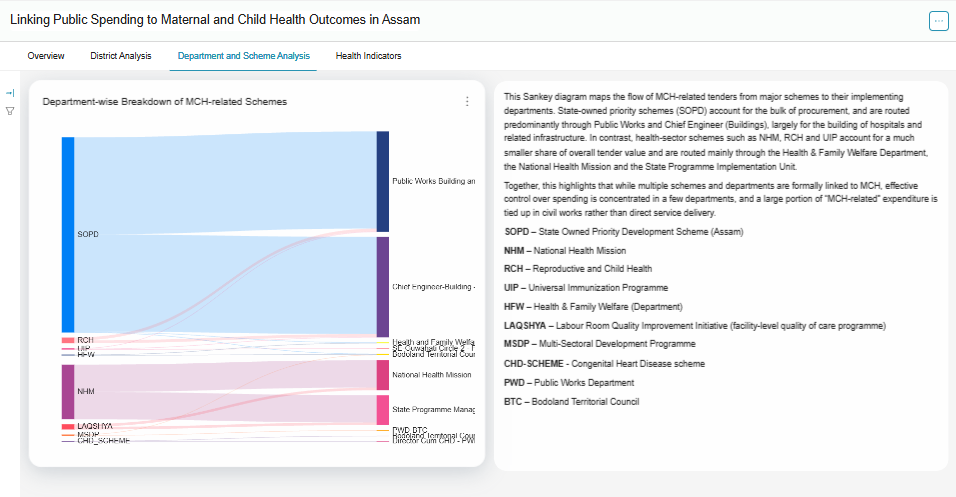
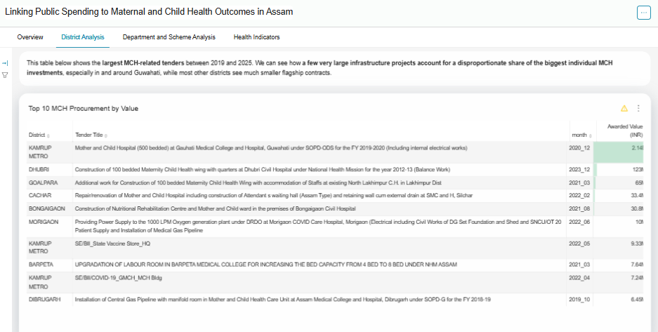

# Usage scenarios to understand overall MCH procurement

Enter the dashboard linked to this use case to analyse the data.

## 1. How many MCH-related tenders have been issued in Assam, and what is the total value of MCH-related procurement?

**Why This Matters, and to Whom:** Understanding the overall scale of MCH-related procurement provides a starting point for examining how public resources are being directed towards maternal and child health. This baseline figure is useful across the board, for government officials assessing overall investment, researchers scoping an analysis, and civil society organizations gauging the size of public commitment to MCH.

**Where to look:** Navigate to the Overview tab at the top of the dashboard. The dashboard reports 112 MCH-related tenders with a total of ₹3,269,789,064 spent towards MCH outcome improvement over the period 2019 to 2025.

*Figure 2: Summary indicators showing total MCH-related tenders and procurement value.*

**What the dashboard shows:** Between 2019 and 2025, a total of 112 MCH-related tenders were issued in Assam, with a combined value of approximately ₹3.27 billion (INR 3,269,789,064) spent towards MCH outcome improvement.

**What to notice:** These headline figures represent the published subset of MCH-related procurement. Given that only about 20% of Assam's tenders are published, the actual scale of MCH-related procurement is likely to be larger.

## 2. Which schemes fund MCH-related procurement in Assam, and how does spending flow from schemes to implementing departments?

**Why This Matters, and to Whom:** MCH-related procurement involves multiple schemes and departments. Knowing where spending is concentrated helps understand whether resources are directed towards infrastructure, service delivery, or both. This is particularly useful for government and policymakers working on budget allocation and scheme design.

**Where to look:** Navigate to the Department and Scheme Analysis tab to view the Sankey diagram. This Sankey diagram maps the flow of MCH-related tenders from major schemes to their implementing departments.

*Figure 3: Sankey diagram showing flow of MCH-related tenders from schemes to departments.*

**What the dashboard shows:** State-Owned Priority Development (SOPD) schemes account for the bulk of procurement, with approximately ₹2.19 billion routed through Public Works Building and NH Department and Chief Engineer (Buildings), largely for the building of hospitals and related infrastructure.

Health-sector schemes account for comparatively smaller shares:

| Scheme | Routed through | Approximate tender value |
|---|---|---|
| NHM (National Health Mission) | National Health Mission; State Programme Management Unit | ₹615 million |
| RCH (Reproductive and Child Health) | Public Works Building and NH Department | ₹65 million |
| LAQSHYA (Labour Room Quality Improvement Initiative) | State Programme Management Unit, NHM | ₹58.5 million |
| MSDP (Multi-Sectoral Development Programme) | Bodoland Territorial Council; PWD-BTC | ₹14.5 million |
| HFW / SOPD via BTC | Health and Family Welfare, BTC; Bodoland Territorial Council | ₹10 million |
| CHD-SCHEME (Congenital Heart Disease Scheme) | Bodoland Territorial Council, PWD | ₹9.7 million |
| UIP (Universal Immunisation Programme) | Public Works Building and NH Department | ₹9.3 million |

**What to notice:** While multiple schemes and departments are formally linked to MCH, effective control over spending is concentrated in a few departments, and a large portion of "MCH-related" expenditure is tied up in civil works rather than direct service delivery.

**Data Note:** To contextualise these patterns, CDL also mapped all schemes relevant to maternal and child health, including Pradhan Mantri Matru Vandana Yojana (PMMVY), POSHAN Abhiyan, Integrated Child Development Services (ICDS), and tea garden welfare initiatives, helping to link procurement activity to key policy interventions.

## 3. What proportion of MCH-related spending goes towards infrastructure (civil works) versus direct health service delivery?

**Why This Matters, and to Whom:** The type of procurement matters. Infrastructure investments and programme or service-related investments support maternal and child health in different ways. This distinction is useful for policymakers and public health practitioners weighing infrastructure investment against direct service delivery needs.

**Where to look:** Two tabs: Department and Scheme Analysis + District Analysis.

*Figure 4: Sankey diagram (Department and Scheme Analysis tab) and the Top 10 MCH Procurement by Value table (District Analysis tab) explored together.*

**What the dashboard shows:** State-owned priority schemes (SOPD) account for the bulk of procurement and are routed predominantly through Public Works and Chief Engineer (Buildings), largely for the building of hospitals and related infrastructure.

In contrast, health-sector schemes such as NHM, RCH, and UIP account for a much smaller share of overall tender value and are routed mainly through the Health and Family Welfare Department, the National Health Mission, and the State Programme Implementation Unit.

The Top 10 tenders confirm this pattern. The largest individual MCH investments are infrastructure projects:

* ₹2.14 billion: Mother and Child Hospital (500 bedded) at GMCH, Guwahati
* ₹123 million: 100 bedded Maternity Child Health wing at Dhubri Civil Hospital
* ₹65 million: 100 bedded Maternity Child Health Wing at North Lakhimpur
* ₹33.4 million: Repair/renovation of Mother and Child Hospital at Silchar
* ₹30.8 million: Nutritional Rehabilitation Centre and Mother and Child ward at Bongaigaon

**What to notice:** A large portion of "MCH-related" expenditure is tied up in civil works rather than direct service delivery. A few very large infrastructure projects account for a disproportionate share of the biggest individual MCH investments, especially in and around Guwahati, while most other districts see much smaller flagship contracts.
