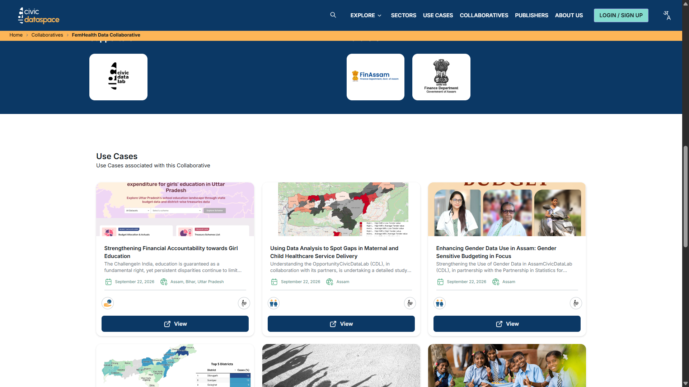
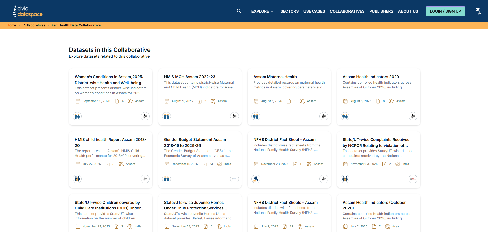

# Navigating the Collaborative

You can open the FemHealth Data Collaborative from CivicDataSpace's listing page for collaboratives: [https://civicdataspace.in/collaboratives/femhealth-data-collaborative](https://civicdataspace.in/collaboratives/femhealth-data-collaborative)

## At the top of the page

You'll see the collaborative's name, a row of topic tags giving a quick sense of what subject areas it covers, and an illustration representing the mission. Just below, three summary numbers show the scale of the collaborative: use cases, datasets, and organizations involved.

Underneath, a short description explains the problem the collaborative addresses, roughly why the data exists and what gap it's meant to close, along with who's involved in bringing it together.

## Exploring what's been built: Use Cases

Scroll down to the "Use Cases" section. Select "View" on any use case card to open it and see the full analysis.

This is the section to start with if you want to see what's actually been done with the data and understand real applications before you look at the raw datasets themselves.

## Getting the data: Datasets

Further down is the "Datasets in this Collaborative" section, listing the datasets tied to this collaborative.

Select a dataset card to open it, and use the download icon to get the raw file for your own use.
